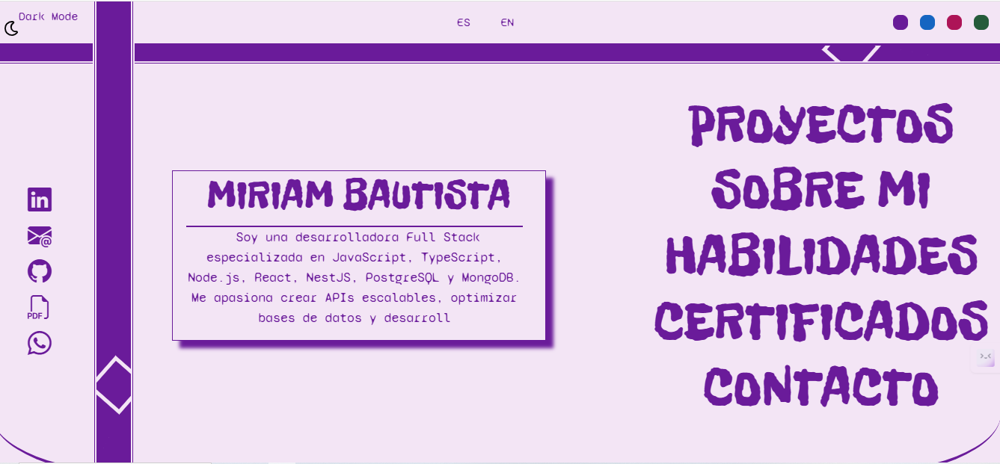

# **Portafolio Web - Anibau** 🌐  

🚀 **Desarrolladora Full Stack | JavaScript, TypeScript, Node.js, React, NestJS, PostgreSQL, MongoDB**  

Este es mi portafolio web donde presento mi perfil profesional, experiencia y proyectos en desarrollo de software. Está diseñado con **HTML, CSS, JavaScript y Bootstrap** y está desplegado en **GitHub Pages**.  

🔗 **[Ver Portafolio en Vivo](https://anibau.github.io/Portafolio-web/)**  

---

## 📌 **Características del Portafolio**  
✅ Diseño moderno y responsive 📱💻  
✅ Secciones bien estructuradas: Sobre mí, Proyectos y Contacto  
✅ Implementado con **Bootstrap** para una UI atractiva y responsiva  
✅ Desplegado en **GitHub Pages**  
✅ Funcionalidad en **Dark/Light mode**  
✅ Funcionalidad en **Colores dinamicos generales**  
✅ Funcionalidad en **version ES/EN**  

---

## 🛠️ **Tecnologías Utilizadas**  
- **HTML5** → Estructura semántica  
- **CSS3** → Estilos y animaciones  
- **JavaScript (ES6+)** → Interactividad y dinámicas del sitio  
- **Bootstrap 5** → Diseño responsivo y componentes preconstruidos  
- **GitHub Pages** → Hosting del portafolio  

---

### 🖼️ **Vista del Portafolio**  

  

---

<!-- ## 🚀 **Cómo Ver el Proyecto en Local**  
Si deseas descargar y ejecutar el proyecto en tu máquina local, sigue estos pasos:  

1. **Clona este repositorio:**  
   ```bash
   git clone https://github.com/Anibau/Portafolio-web.git -->
